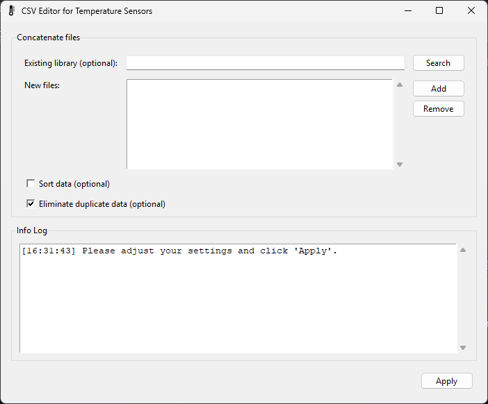
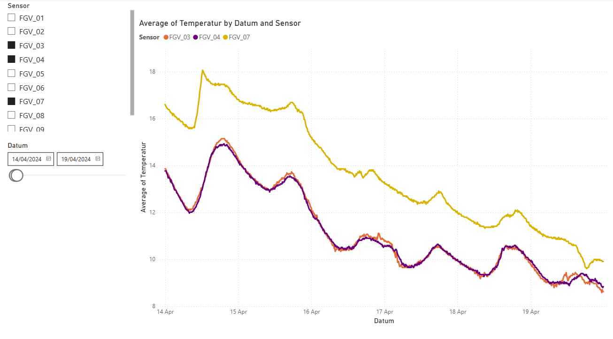

### Language

# Purpose

This tool is used by the [Fischerei- und Gewässerschutzverein Steinheim e.V.](https://fgv-steinheim.de/fgv/) (FGV) to combine the data of water temperature sensors for a combined visualization in Microsoft Power BI.

This program can be used to concatenate excel files containing the data collected from temperature sensors. The purpose of this project specifically is to use the data of temperature sensors, which are placed in different positions of water bodies for tracking purposes.

# Installing

> [!WARNING]
> The .toml files must be located in the same folder as the .exe file for the application to function correctly.

## zip
Download the .zip file from the releases, extract it, and start the .exe.

## Installer
Download the installer .exe file from the releases and install it using the setup wizard. Make sure to note the installation path so you can adjust the settings and sensors later.

# Usage

This small user interface allows you to import Microsoft Excel files containing temperature sensor measurement data. These files are combined into a single large CSV file containing all the data. The files must contain three columns: one for the temperature, one for the timestamp, and one index column. Column names and other settings can be configured in the file [settings.toml](./settings.toml). The sensor data files must include the sensor name; the search pattern can also be customized in this file using a regular expression. When importing the sensor data, [sensors.toml](./sensors.toml) is used to match the names. Therefore, all sensors to be imported should be defined here along with their corresponding location. This location is then added to the data in the output file.

# Attributions

Application icon: \
[Thermometer icons created by apien - Flaticon](https://www.flaticon.com/free-icons/thermometer)

# Screenshots

 
Screenshot of the application

Screenshot of the Power BI visualization